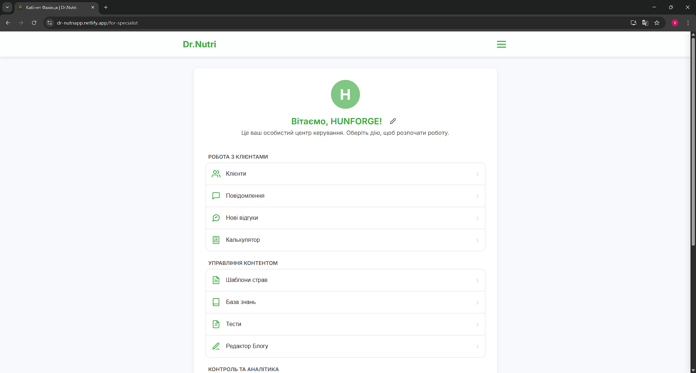

# 🚀 Проєкт "Dr.Nutri" — Персональний Помічник Нутриціолога

**[➡️ Переглянути живий сайт (Live Demo)](https://dr-nutriapp.netlify.app/)**

---

## 📄 Про Проєкт

**Dr.Nutri** — це сучасний, повнофункціональний веб-застосунок (PWA), розроблений як комплексна B2B-платформа для взаємодії між нутриціологом та його клієнтами. Проєкт реалізовано як односторінковий застосунок (SPA) з використанням сучасного технологічного стека, що забезпечує високу продуктивність, безпеку та чудовий досвід користувача.

Цей репозиторій є **публічною вітриною** проєкту. Вихідний код є приватною інтелектуальною власністю.

---

## ✨ Ключові Особливості

### Для Нутриціолога:
-   **Повне управління клієнтами:** Створення, редагування, пошук, фільтрація та архівування профілів.
-   **Глибокий аналіз даних:** Доступ до всіх параметрів, анамнезу, історії ваги та щоденників клієнта в реальному часі.
-   **Потужний редактор планів харчування:** Створення індивідуальних раціонів з інтегрованою генерацією за допомогою **Google Gemini AI**.
-   **Комплексна CMS-панель:** Повноцінна система управління контентом (блог, база знань, тести, редактор юридичних документів).
-   **Система управління командою:** Можливість для власника платформи керувати командою фахівців, призначати клієнтів та моніторити активність.
-   **Моніторинг витрат AI:** Вбудований дашборд для аналізу використання та ефективності кешування запитів до Gemini AI.

### Для Клієнта:
-   **Персональний кабінет:** Інтерактивний дашборд з онбордингом та відстеженням прогресу.
-   **Інтерактивний "Нутрі-Компаньйон":** Персонаж-помічник, що перетворює рутину на захоплюючу гру з системою досвіду (XP) та досягнень.
-   **Самостійне введення даних:** Зручні форми для заповнення всіх необхідних даних, включаючи фото-щоденник харчування.
-   **Підтримка та мотивація:** Прямий зв'язок з фахівцем через чат та система автоматичних досягнень.

---

## 🛠️ Технологічний Стек

Цей проєкт демонструє глибоке володіння сучасними технологіями веб-розробки:

| Категорія | Технологія |
| :--- | :--- |
| **Frontend** | React 18+, TypeScript, Vite, Framer Motion |
| **Керування станом** | Zustand |
| **Backend & База Даних**| Firebase (Auth, Firestore, Storage, Functions v2) |
| **Інтеграція AI** | Google Gemini AI через захищену хмарну функцію |
| **Стилізація** | Чистий CSS з CSS Variables |
| **PWA** | Vite PWA Plugin |

---

## 🏆 Технічні Архітектурні Досягнення

*   **Render-as-You-Fetch:** Реалізовано завдяки слухачам Firestore (`onSnapshot`), що забезпечує миттєве оновлення даних в усьому застосунку в реальному часі.
*   **Оптимізація Продуктивності:** Асинхронне завантаження Firebase SDK, розділення коду (Code Splitting), оптимізація зображень та PWA-функціональність для максимальних показників Core Web Vitals.
*   **Безпечна Архітектура AI:** Інтеграція з Google Gemini реалізована через безпечну хмарну функцію з серверним кешуванням, що унеможливлює витік API-ключа та значно оптимізує витрати.
*   **Система Ролей (B2B):** Впроваджено гнучку систему ролей (Власник, Фахівець, Клієнт) на основі Firebase Custom Claims та правил безпеки Firestore, що дозволяє масштабувати продукт до рівня онлайн-клініки.

---

## 🖼️ Галерея

| Кабінет Фахівця | Кабінет Клієнта | Редактор Планів |
| :---: | :---: | :---: |
|  |  |  |
| **Моніторинг AI** | **Блог** | **"Паперовий Клієнт"** |
|  |  |  |

---

Створено **[HunForge](https://github.com/HunForge)**.
